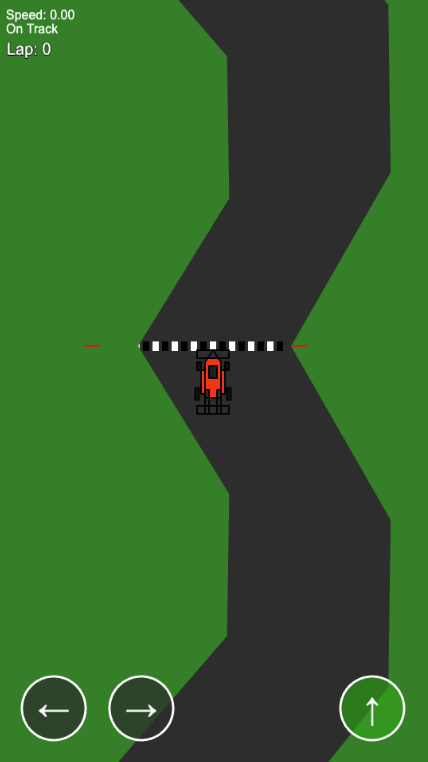

# Vibe-coder racer game

Coded (mostly) with AI.

- Created with Gemini CLI
- Hit a snag and went Aider/Deepseek R1 to polish
- R1 got stuck on modeling the car, went back to Gemini
- Gemini got stuck on drawing the track, Claude Sonnet to the rescue
- Claude Sonnet polishing
- Claude got stuck on the on-scren controls with the view port
- Gemini can't figure it out either
- Manually jumped in to debug got the controlled fixed
- Manual polishing, it got things like 'lap count' offset wrong, trivial fix (hack)
- Gemini and Claude both got stuck on multi-touch controls
- Had prompt Gemini to Google for docs, then it managed to fix it

Give it a spin at:
https://www.clianz.com/vibe-racer/

